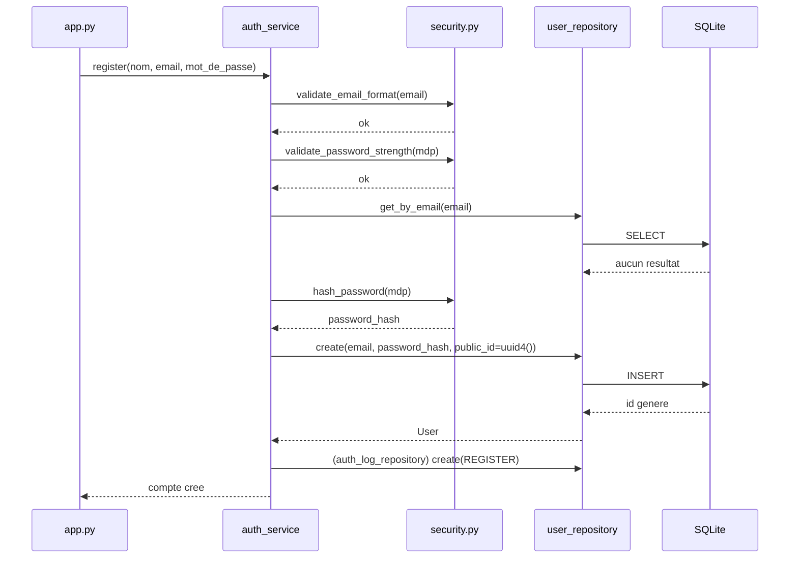
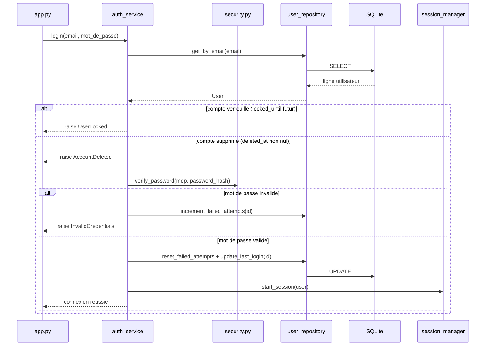
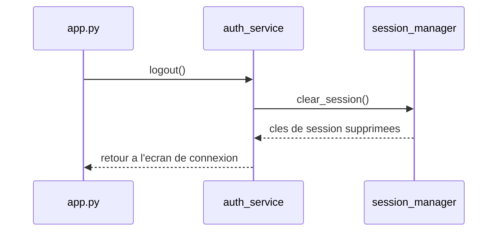
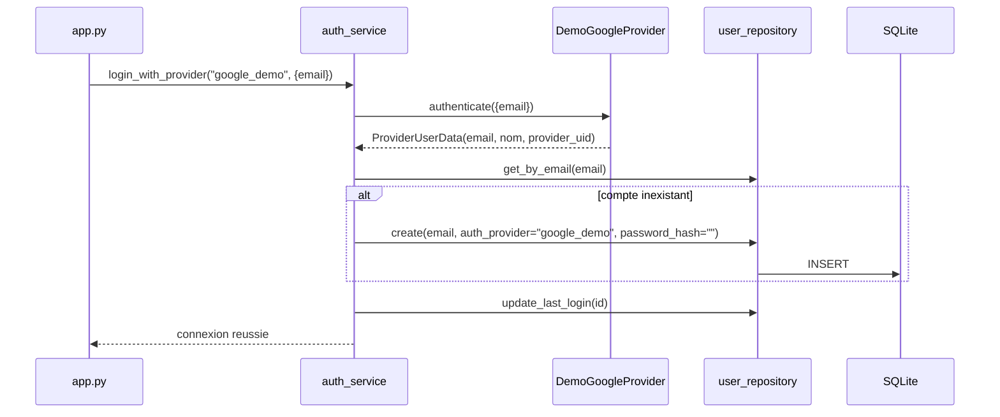
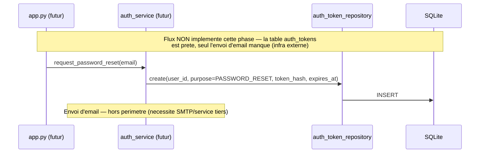
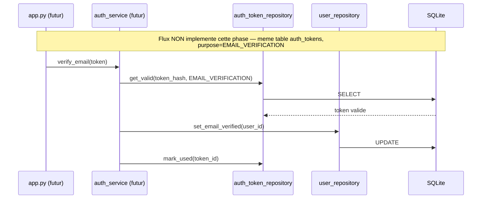
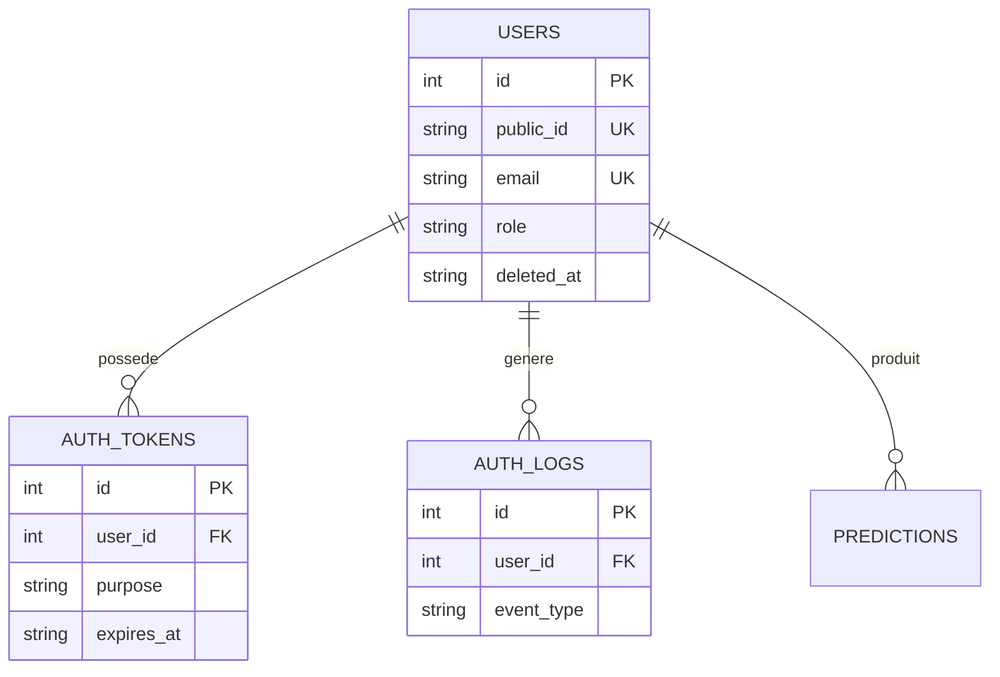
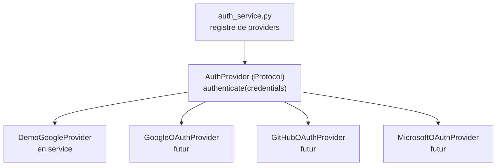

# FitMind AI — Architecture d'authentification (Phase 4)

**Document d'architecture consolidé** · Aucun code n'a été écrit — ce document synthétise et fige les décisions prises et validées au fil des échanges précédents, avant le démarrage de l'implémentation incrémentale.

---

## 0. Résumé exécutif

L'authentification actuelle repose entièrement sur `st.session_state` (aucune persistance, hachage SHA-256 sans sel, aucune validation sérieuse). L'objectif de cette phase est de la remplacer par un système persistant en SQLite, avec une séparation stricte UI → Services → Repositories → Database, un hachage de mot de passe professionnel (bcrypt), un modèle de données préparé pour OAuth/JWT/API REST/Password Reset/Email Verification sans migration lourde future, et **zéro régression** sur le Dashboard Premium (Phase 2) et la couche SQLite des prédictions (Phase 3).

---

## 1. Audit complet de l'authentification actuelle

| Aspect | État | Verdict |
|---|---|---|
| Stockage des comptes | `st.session_state.users_db` (dict en mémoire) | 🔴 À remplacer — disparaît à chaque redémarrage/nouvelle session |
| Hachage des mots de passe | `hashlib.sha256(...)` sans sel | 🔴 À remplacer — SHA-256 est rapide, donc vulnérable au brute-force et aux rainbow tables ; ce n'est pas un algorithme conçu pour des mots de passe |
| Emplacement de la logique | `do_login`, `do_register`, `do_logout` en fonctions top-level dans `app.py` | 🔴 À déplacer — logique métier mélangée à l'UI, même défaut que `prediction_form` avant l'extraction de `recommendation_service` en Phase 2 |
| Validation mot de passe | `len(pwd) < 6` uniquement | 🔴 À remplacer par une vraie politique |
| Validation email | Aucune (le flux "Google" accepte toute chaîne contenant `@`) | 🔴 À ajouter |
| Gestion des doublons | Clé de dict Python | 🟡 Fonctionne mais uniquement en mémoire — à refaire avec une contrainte SQL `UNIQUE` |
| Rôles | Chaîne libre `'client'`/`'admin'` | 🟡 À contraindre (enum + `CHECK` SQL) — une faute de frappe casse silencieusement le routage aujourd'hui |
| Session applicative | `st.session_state.auth` (bool), aucune expiration | 🟡 À conserver dans l'esprit (pas de cookies), mais à structurer et à borner dans le temps |
| Connexion "Google" | Accepte toute chaîne `@`, aucun vrai OAuth | 🟢 À conserver tel quel en tant que démo assumée, simplement renommée/isolée (`DemoGoogleProvider`) — la "sécuriser" serait de la sur-ingénierie d'une fonctionnalité volontairement factice |
| Panneau admin "Utilisateurs" | N'affiche jamais le mot de passe/hash | 🟢 Bon réflexe existant — à préserver explicitement dans la nouvelle version |
| Contrat retour des fonctions | `do_login()` retourne un tuple `(ok, message)` | 🔴 À remplacer par des exceptions typées — plus extensible, plus lisible côté appelant |

**Fichiers concernés** : uniquement `app.py` (bloc auth ~L600-786 + routage final ~L1320-1328). Aucun autre fichier (`dashboard/`, `services/`, `database/`) n'a besoin d'être modifié dans sa logique — le Dashboard reçoit déjà un simple dict `user`, indifférent à sa provenance.

---

## 2. Nouvelle architecture

```
auth/
├── __init__.py
├── auth_config.py       — toutes les constantes de sécurité (aucune ailleurs dans le projet)
├── enums.py               — Role, AuthEventType, TokenPurpose
├── exceptions.py          — AuthError (base) + sous-classes typées
├── security.py            — hachage bcrypt, validation mot de passe / email (fonctions pures)
├── session_manager.py     — pont vers st.session_state : session courante, expiration, logout
└── providers.py            — interface AuthProvider + DemoGoogleProvider (préparation OAuth)

services/
└── auth_service.py        — orchestration : register(), login(), logout(), change_password()
                              (toute la logique métier vit ici, nulle part ailleurs)

database/
├── database.py            — connexion SQLite + transactions (déjà en place, Phase 3)
├── models.py               — dataclasses (User, Prediction, Goal, Settings...) (déjà en place)
├── migrations.py           — migrations versionnées et idempotentes (déjà en place)
└── repositories/
    ├── user_repository.py
    ├── auth_token_repository.py
    └── auth_log_repository.py
```

### Rôle précis de chaque fichier

| Fichier | Fait | Ne fait jamais |
|---|---|---|
| `auth/auth_config.py` | Définit `BCRYPT_ROUNDS`, `PASSWORD_MIN_LENGTH`, `PASSWORD_REQUIRE_DIGIT`/`REQUIRE_LETTER`, `MAX_FAILED_LOGIN_ATTEMPTS`, `LOCKOUT_DURATION_MINUTES`, `SESSION_INACTIVITY_TIMEOUT_MINUTES`, `AUTH_TOKEN_EXPIRY_MINUTES` (par `purpose`), `DEMO_ACCOUNTS` | Aucune logique — valeurs pures uniquement |
| `auth/enums.py` | `Role(str, Enum)` (`CLIENT`, `ADMIN`), `AuthEventType(str, Enum)` (événements d'audit), `TokenPurpose(str, Enum)` (`PASSWORD_RESET`, `EMAIL_VERIFICATION`) | Aucun accès DB/Streamlit |
| `auth/exceptions.py` | `AuthError` (base) → `InvalidCredentials`, `UserLocked`, `UserNotFound`, `DuplicateEmail`, `WeakPassword`, `InvalidEmailFormat`, `AccountDeleted`, `TokenExpired`, `InvalidToken` | Aucune logique métier, juste des classes |
| `auth/security.py` | `hash_password()`, `verify_password()`, `validate_password_strength()`, `validate_email_format()` | N'accède jamais à la base ni à `st.session_state` |
| `auth/session_manager.py` | `start_session(user)`, `get_current_user()`, `is_authenticated()`, `clear_session()`, `is_session_expired()` | N'exécute jamais de SQL, ne connaît pas bcrypt |
| `auth/providers.py` | `AuthProvider` (Protocol), `DemoGoogleProvider`, registre `{nom: provider}` | Ne contient aucune règle métier d'inscription/connexion — seulement l'authentification externe |
| `services/auth_service.py` | Orchestre `security.py` + `session_manager.py` + `providers.py` + les repositories ; lève les exceptions d'`auth/exceptions.py` | Aucun SQL direct, aucun HTML/Streamlit direct |
| `database/repositories/user_repository.py` | `create()`, `get_by_email()`, `get_by_id()`, `get_by_public_id()`, `list_users()`, `update_last_login()`, `soft_delete()` | Aucune règle métier (pas de hachage, pas de validation) |
| `database/repositories/auth_token_repository.py` | `create()`, `get_valid(token_hash, purpose)`, `mark_used()` | Idem — CRUD pur |
| `database/repositories/auth_log_repository.py` | `create()`, `list_for_user()` | Idem — CRUD pur |

---

## 3. Diagrammes de flux

### Register



Erreurs possibles interceptées par `app.py` via `except AuthError` : `InvalidEmailFormat`, `WeakPassword`, `DuplicateEmail`.

### Login



### Logout



### Google Demo



Ce flux reste explicitement une démo (aucune vérification d'identité réelle) — c'est documenté comme tel dans `auth/providers.py`, pas dissimulé.

### Password Reset — préparation uniquement



### Email Verification — préparation uniquement



**Décision clé** : `password_reset` et `email_verification` partagent **une seule table `auth_tokens`** (colonne `purpose`) plutôt que deux tables séparées — même mécanisme de token à durée de vie limitée, réutilisable aussi pour un futur "magic link" sans nouvelle table.

---

## 4. Schéma SQLite — migration v2 (additive, ne casse pas la v1 de la Phase 3)

### `users`

| Colonne | Type | Pourquoi elle existe | Utilité future |
|---|---|---|---|
| `id` | `INTEGER PK AUTOINCREMENT` | Clé technique pour les jointures internes | — |
| `public_id` | `TEXT UNIQUE NOT NULL` (UUID4) | Identifiant exposable en dehors de la base | Seul identifiant utilisable dans une future API REST/JWT — ne jamais exposer `id` (énumération, comptage d'utilisateurs) |
| `username` | `TEXT` | Nom affiché | — |
| `email` | `TEXT UNIQUE NOT NULL` | Identifiant de connexion | — |
| `password_hash` | `TEXT NOT NULL` | Hash bcrypt | — |
| `role` | `TEXT NOT NULL DEFAULT 'client' CHECK(role IN ('client','admin'))` | Routage client/admin | `CHECK` car seulement 2 valeurs stables — contrainte forte justifiée |
| `auth_provider` | `TEXT NOT NULL DEFAULT 'password'` | Distingue compte mot de passe vs `google_demo` | Futurs providers (`google`, `github`, `microsoft`) ajoutés sans migration — colonne déjà libre |
| `email_verified_at` | `TEXT NULL` | `NULL` = non vérifié | Active la fonctionnalité Email Verification sans nouvelle colonne le jour venu |
| `last_login_at` | `TEXT NULL` | Horodatage de dernière connexion | Sécurité (détection d'anomalie), Analytics futur |
| `failed_login_attempts` | `INTEGER NOT NULL DEFAULT 0` | Compteur d'échecs | Base du verrouillage anti-brute-force |
| `locked_until` | `TEXT NULL` | Verrouillage temporaire | Idem |
| `created_at`, `updated_at` | `TEXT NOT NULL` | Traçabilité standard | — |
| `deleted_at` | `TEXT NULL` | Soft-delete (`NULL` = actif) | Permet de "supprimer" un compte sans perdre l'historique des prédictions liées (FK), et sans migration de schéma pour ajouter la fonctionnalité plus tard |

### `auth_tokens`

| Colonne | Type | Pourquoi | Utilité future |
|---|---|---|---|
| `id` | `INTEGER PK` | — | — |
| `user_id` | `INTEGER NOT NULL REFERENCES users(id)` | Propriétaire du token | — |
| `purpose` | `TEXT NOT NULL CHECK(purpose IN ('password_reset','email_verification'))` | Un seul mécanisme, plusieurs usages | Ajouter un `'magic_link'` plus tard = une valeur de `CHECK` à ajouter (migration mineure), pas une nouvelle table |
| `token_hash` | `TEXT NOT NULL` | Jamais stocker le token en clair | — |
| `expires_at` | `TEXT NOT NULL` | Durée de vie bornée | Durées centralisées dans `auth_config.py` |
| `used_at` | `TEXT NULL` | Empêche la réutilisation d'un token | — |
| `created_at` | `TEXT NOT NULL` | Traçabilité | — |

### `auth_logs`

| Colonne | Type | Pourquoi | Utilité future |
|---|---|---|---|
| `id` | `INTEGER PK` | — | — |
| `user_id` | `INTEGER NULL REFERENCES users(id)` | Nullable : un login échoué sur un email inexistant n'a pas d'utilisateur | — |
| `event_type` | `TEXT NOT NULL` (**pas de `CHECK`**, validé côté Python via `AuthEventType`) | Décision volontaire : `role` a 2 valeurs stables (⇒ `CHECK` justifié), `event_type` va grandir avec le temps (⇒ `CHECK` créerait une migration à chaque nouvel événement) | Ajouter `ROLE_CHANGED`, `PASSWORD_RESET_COMPLETED`, etc. = un membre d'enum, zéro migration |
| `detail` | `TEXT NULL` | Contexte libre (JSON si besoin) | — |
| `created_at` | `TEXT NOT NULL` | — | — |

**Limite assumée** : pas de colonne `ip_address` — Streamlit n'expose pas l'IP client de façon fiable nativement ; ajout possible plus tard via un composant custom si nécessaire.



---

## 5. Sécurité

### bcrypt vs Argon2 vs SHA-256

| Critère | SHA-256 (actuel) | bcrypt (retenu) | Argon2 |
|---|---|---|---|
| Conçu pour les mots de passe | ❌ Non — algorithme de hachage générique, très rapide | ✅ Oui — délibérément lent, facteur de coût réglable | ✅ Oui — vainqueur du concours Password Hashing Competition 2015, recommandé en premier choix par l'OWASP aujourd'hui |
| Résistance au brute-force | ❌ Faible (des milliards de hash/s sur GPU) | ✅ Bonne, réglable via `BCRYPT_ROUNDS` | ✅ Meilleure, résistant aussi aux attaques GPU/ASIC (paramètre mémoire) |
| Disponibilité en environnement Streamlit Cloud | — | ✅ Wheels précompilées disponibles pour toutes plateformes courantes, aucune compilation requise | ⚠️ `argon2-cffi` nécessite `cffi` + parfois une compilation native selon la plateforme — risque de déploiement plus élevé sur un environnement géré comme Streamlit Cloud |
| Maturité / adoption | — | Standard de facto depuis 20+ ans, très largement audité | Plus récent, excellent mais légèrement moins universellement supporté "out of the box" |
| Sel intégré | — | ✅ Automatique | ✅ Automatique |

**Décision : bcrypt.** Argon2 est techniquement l'algorithme le plus recommandé aujourd'hui, mais le risque de déploiement (compilation native sur Streamlit Cloud) n'est pas justifié pour ce projet, alors que bcrypt offre déjà un niveau de sécurité largement suffisant et sans surprise de déploiement. Point important : ce choix est **isolé dans `auth/security.py`** — si Argon2 devient nécessaire plus tard (montée en charge, exigence de conformité), seul ce fichier change, aucun appelant n'est impacté.

### Récapitulatif des mesures de sécurité

- **Politique de mot de passe** : longueur ≥ 8, au moins une lettre et un chiffre (`auth_config.py`)
- **Verrouillage de compte** : `MAX_FAILED_LOGIN_ATTEMPTS` puis `locked_until` pendant `LOCKOUT_DURATION_MINUTES`
- **Échecs de connexion** : compteur `failed_login_attempts`, remis à zéro à la connexion réussie
- **Audit log** : table `auth_logs`, événements de base journalisés dès l'Étape 4 (login/register/logout), extensible sans migration
- **Soft delete** : `deleted_at`, jamais de suppression physique d'un utilisateur ayant des prédictions liées (FK)
- **UUID public** : `public_id`, jamais l'`id` interne exposé
- **Email verification / Password reset** : schéma prêt (`auth_tokens`), flux non construit cette phase (dépendance externe : envoi d'email)
- **Aucun secret exposé** : le panneau admin ne sélectionne jamais `password_hash`

---

## 6. Extensibilité — OAuth / Microsoft / GitHub / JWT / API REST sans modifier `auth_service.py`



Ajouter un provider réel = une nouvelle classe respectant le `Protocol AuthProvider` + une entrée dans le registre. `auth_service.py` ne change jamais.

**JWT / API REST** : `auth_service.login()` retourne un `User` (dataclass) et lève des exceptions — il ne touche jamais `st.session_state`. C'est précisément pour ça que `session_manager.py` est un fichier séparé : une future API REST appellerait `auth_service.login()` exactement comme `app.py` le fait aujourd'hui, mais émettrait un JWT signé à la place d'appeler `session_manager.start_session()`. La logique métier ne serait jamais dupliquée.

---

## 7. Pourquoi Clean Architecture (UI → Services → Repositories → Database)

- **Testabilité** : chaque couche est testable isolément sans Streamlit ni base de données (déjà démontré en Phase 2 avec `history_service.py`, testé hors Streamlit).
- **Remplaçabilité** : SQLite pourrait être remplacé par PostgreSQL demain en ne touchant que `database/database.py` et les repositories — jamais `auth_service.py` ni `app.py`.
- **Lisibilité** : un nouveau développeur sait immédiatement où chercher une règle métier (`services/`) vs une requête SQL (`database/repositories/`) vs de l'affichage (`app.py`/`dashboard/`).
- **Prévention de la dette technique** : c'est la même architecture déjà validée et testée en Phase 3 pour les prédictions — la reproduire pour l'auth évite d'avoir deux styles différents dans le même projet.

**Alternative écartée** : un ORM (SQLAlchemy) aurait pu remplacer le pattern Repository. Écarté pour rester cohérent avec le choix déjà fait en Phase 3 (aucune nouvelle dépendance lourde, `sqlite3` standard suffit à l'échelle du projet).

---

## 8. Compatibilité totale avec le Dashboard Premium

`dashboard/dashboard_page.py::render(user, predictions, metadata)` continue de recevoir un dict `user` avec exactement les clés `email`, `name`, `role`, `initials`. `auth_service.py` fournira un adaptateur `to_session_dict(user: User) -> dict` qui reproduit cette forme à partir du nouveau `User` (dataclass). **Aucune ligne de `dashboard/*.py` n'est modifiée.**

---

## 9. Migration des comptes de démonstration

`admin@fitmind.ai` et `client@demo.com` sont recréés en base au premier démarrage après cette phase, avec leurs mots de passe actuels **rehachés en bcrypt**. Garanties :

- **Idempotente** : vérification `get_by_email()` avant toute insertion — ne s'exécute qu'une fois utilement.
- **Transactionnelle** : passe par `get_connection()` (rollback automatique en cas d'erreur, déjà testé en Phase 3).
- **Sans écrasement** : uniquement des `INSERT`, jamais d'`UPDATE` sur un compte déjà existant — si un vrai utilisateur a le même email qu'un compte de démo, ses données ne sont jamais touchées.

---

## 10. Plan de tests complet

| Catégorie | Tests |
|---|---|
| **Unitaires — `security.py`** | hash/verify round-trip ; deux hash du même mot de passe diffèrent (sel) ; mot de passe faible → `WeakPassword` ; email malformé → `InvalidEmailFormat` |
| **Unitaires — `enums.py`/`exceptions.py`** | valeurs de `Role` synchronisées avec le `CHECK` SQL ; toutes les exceptions spécifiques héritent d'`AuthError` |
| **Intégration — repositories** | `create()` + `get_by_email()` round-trip ; `UNIQUE(email)` respectée (doublon → erreur) ; `soft_delete()` ne supprime pas la ligne, positionne `deleted_at` |
| **Intégration — `auth_service`** | `register()` complet ; `login()` succès/échec/verrouillage/compte supprimé ; `logout()` nettoie la session ; migration des comptes démo idempotente |
| **Sécurité** | Brute-force simulé → verrouillage après N tentatives ; mot de passe jamais loggé en clair ; `password_hash` absent de tout affichage admin |
| **Migration** | Base créée automatiquement ; ré-exécution sans perte (idempotence) ; persistance testée entre deux processus Python distincts (simulation de redémarrage) ; contraintes `UNIQUE`/`FOREIGN KEY`/`CHECK` vérifiées par des cas volontairement invalides |
| **Non-régression / Smoke test** | Démarrage réel `streamlit run app.py` → HTTP 200, aucune erreur ; connexion → Dashboard s'affiche normalement avec toutes ses cartes ; panneau admin fonctionnel |

---

## 11. Roadmap incrémentale

| Étape | Contenu | Validation avant la suivante |
|---|---|---|
| **1** | `auth_config.py`, `enums.py`, `exceptions.py`, `security.py` — aucune dépendance DB/Streamlit | Tests unitaires uniquement |
| **2** | Migration v2 (`users` complet + `auth_tokens` + `auth_logs`) + les 3 repositories | Tests d'intégration + vérification des contraintes SQL |
| **3** | `services/auth_service.py` + `session_manager.py` + `providers.py` (`DemoGoogleProvider`) | Tests d'intégration hors Streamlit |
| **4** | Branchement dans `app.py` + migration automatique des comptes démo | Smoke test complet + non-régression Dashboard |
| **5** | Verrouillage anti-brute-force (raffinement final) | Tests de sécurité dédiés |

Chaque étape suit le même cycle que les Phases 2 et 3 : implémentation → tests → explication → validation → étape suivante. Aucun code n'est écrit avant validation explicite de ce document.
